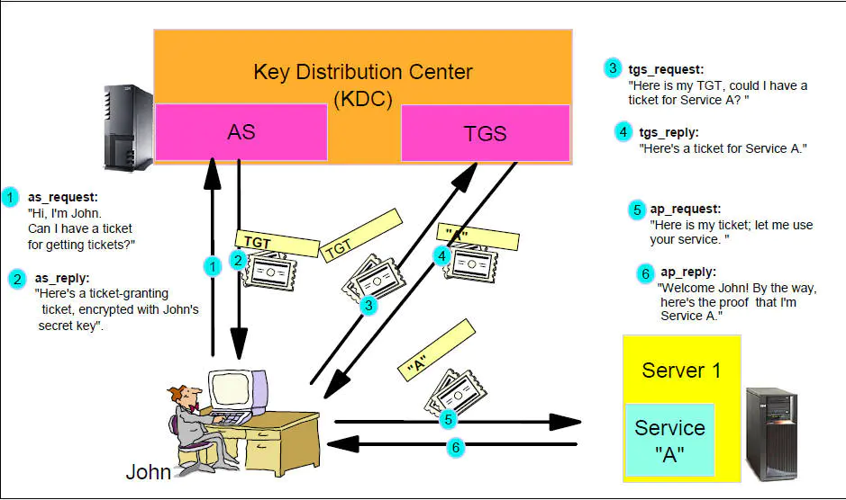

# Kerberos + Kafka

> # The Network Authentication Protocol

- https://kerberos.org/
- https://web.mit.edu/kerberos/
- https://github.com/krb5/krb5
- [kerberos入坑指南](https://www.jianshu.com/p/fc2d2dbd510b)
- [bilibili-彻底理解Windows认证](https://www.bilibili.com/video/BV1S4411q7Cw?p=1)
- [bilibili-快速掌握Hadoop集成Kerberos安全技术](https://www.bilibili.com/video/BV1pV411k7ut?p=1)

Kerberos is a network authentication protocol. It is designed to provide strong authentication for client/server
applications by using secret-key cryptography.

**Kerberos**是一种计算机网络授权协议，用来在非安全网络中，对个人通信以安全的手段进行身份认证。

## kerberos基本使用

### kerberos配置

所需服务-ubuntu：

```shell
apt-get install krb5-admin-server krb5-kdc krb5-user krb5-config
```

- krb5-admin-server: kdc管理员程序，可以让使用者远程管理kdc数据库。
- krb5-kdc: kdc主程序
- krb5-user: kerberos的一些客户端命令，用来获取、查看、销毁ticket等等。

所需服务-centos：

```shell
# 安装krb的server
yum install krb5-server 

# 安装krb的client
yum install krb5-workstation krb5-libs krb5-auth-dialog
```

配置：

- server
    - /etc/krb5.conf
    - /etc/krb5kdc/kdc.conf # /var/kerberos/krb5kdc/kdc.conf
        - kadm5.acl
- client
    - /etc/krb5.conf

#### krb5.conf

```sh
[libdefaults]
  renew_lifetime = 7d
  forwardable = true
  default_realm = ST.COM
  ticket_lifetime = 24h
  dns_lookup_realm = false
  dns_lookup_kdc = false
  default_ccache_name = /tmp/krb5cc_%{uid}
  #default_tgs_enctypes = aes des3-cbc-sha1 rc4 des-cbc-md5
  #default_tkt_enctypes = aes des3-cbc-sha1 rc4 des-cbc-md5

[logging]
  default = FILE:/var/log/krb5kdc.log
  admin_server = FILE:/var/log/kadmind.log
  kdc = FILE:/var/log/krb5kdc.log

[realms]
  ST.COM = {
    admin_server = node2
    kdc = node2
  }
```

#### kdc.conf

```sh
[kdcdefaults]
 kdc_ports = 88
 kdc_tcp_ports = 88

[realms]
 ST.COM = {
  #master_key_type = aes256-cts
  acl_file = /var/kerberos/krb5kdc/kadm5.acl
  dict_file = /usr/share/dict/words
  admin_keytab = /var/kerberos/krb5kdc/kadm5.keytab
  supported_enctypes = aes256-cts:normal aes128-cts:normal des3-hmac-sha1:normal arcfour-hmac:normal camellia256-cts:normal
 camellia128-cts:normal des-hmac-sha1:normal des-cbc-md5:normal des-cbc-crc:normal
  max_renewable_life = 7d
 }
```

#### kadm5.acl

```sh
# 管理员权限
*/admin@ST.COM       *
```

### 常用命令

```shell
# 创建数据库
kdb5_util create -r ST.COM -s　

# 启动kdc服务
service krb5kdc start
# 启动kadmin服务
service kadmin start　

# 进入kadmin
kadmin.local # master
kadmin  # client

# klist查看登录状态
klist
# 登录，手动输入密码
kinit testt/admin@ST.COM
# 通过keytab文件认证登录
# keytab文件就是密码加密后的文件，过期后可通过keytab自动重新认证，避免每次重新手动输入密码
# keytab通过在kadmin中生成
kinit -kt /etc/security/keytabs/kafka.service.keytab kafka/node1.local@ST.COM
# 查看keytab
klist -e -k -t /etc/security/keytabs/kafka.service.keytab

# 修改当前密码
kpasswd
# 清除缓存
kdestroy
```

### kadmin命令

```shell
# server机器进入kadmin
kadmin.local
# client机器需用acl配置中admin权限规则用户连接后使用 kadmin 命令进入
kadmin

# 生成随机key的principal
addprinc -randkey kafka/node1.local@ST.COM
# 生成指定key的principal
addprinc -pw 123456 testt/admin@ST.COM
# 生成到keytab
ktadd -k /etc/security/keytabs/kafka.service.keytab kafka/node1.local@ST.COM
# 查看principal
listprincs
# 添加/删除principle
addprinc/delprinc admin/admin

# 修改admin/admin的密码
cpw -pw xxxx admin/admin
# 设置密码策略(policy)
addpol -maxlife "90 days" -minlife "75 days" -minlength 8 -minclasses 3 -maxfailure 10 -history 10 user
# 添加带有密码策略的用户
addprinc -policy user hello/admin@ST.COM
# 修改用户的密码策略
modprinc -policy user1 hello/admin@ST.COM
# 删除密码策略
delpol [-force] user
# 修改密码策略
modpol -maxlife "90 days" -minlife "75 days" -minlength 8 -minclasses 3 -maxfailure 10 user

```

## Kerberos认证流程

### 角色

- AD（account database）：存储所有client的白名单，只有存在于白名单的client才能顺利申请到TGT。
- AS（Authentication Service）：为client生成**TGT（Ticket Granting Ticket）**的服务。
- TGS（Ticket Granting Service）：为client生成某个服务的**Ticket**。



### 粗略流程

1.
client向kerberos服务请求，希望获取访问server的权限。kerberos得到了这个消息，首先得判断client是否是可信赖的，也就是白名单黑名单的说法。这就是AS服务完成的工作，通过在AD中存储黑名单和白名单来区分client。成功后，AS返回TGT给client。
2.
client得到了TGT后，继续向kerberos请求，希望获取访问server的权限。kerberos又得到了这个消息，这时候通过client消息中的TGT，判断出了client拥有了这个权限，给了client访问server的权限ticket。
3. client得到ticket后，终于可以成功访问server。这个ticket只是针对这个server，其他server需要向TGS重新申请。

### 具体流程（wikipedia）

（注意：此流程使用了[对称加密](https://zh.wikipedia.org/wiki/对称加密)；此流程发生在某**一个**Kerberos**领域**中；小写字母c,d,e,g是客户端发出的消息，大写字母A,B,E,F,H是各个服务器发回的消息。）

首先，用户使用客户端（用户自己的机器）上的程序进行登录：

1. 用户输入用户ID和密码到客户端。
2. 客户端程序运行一个[单向函数](https://zh.wikipedia.org/wiki/單向函數)（大多数为杂凑）把密码转换成密钥，这个就是客户端（用户）的“用户密钥”(user's secret key)。

随后，**客户端认证**（客户端(Client)从认证服务器(AS)获取票据的票据（TGT））：

1. Client向AS发送1条明文消息，申请基于该用户所应享有的服务，例如“用户Sunny想请求服务”（Sunny是用户ID）。（注意：用户不向AS发送“用户密钥”(user's secret key)
   ，也不发送密码）该AS能够从本地数据库中查询到该申请用户的密码，并通过相同途径转换成相同的“用户密钥”(user's secret key)。
2. AS检查该用户ID是否在于本地数据库中，如果用户存在则返回2条消息：
    - 消息A：**Client/TGS会话密钥(Client/TGS Session Key)**（该Session Key用在将来Client与TGS的通信（会话）上），通过**用户密钥(user's secret key)**
      进行加密
    - 消息B：**票据授权票据(TGT)**（TGT包括：消息A中的“Client/TGS会话密钥”(Client/TGS Session Key)，用户ID，用户网址，TGT有效期），通过**TGS密钥(TGS's secret
      key)**进行加密
3. 一旦Client收到消息A和消息B，Client首先尝试用自己的“用户密钥”(user's secret key)解密消息A，如果用户输入的密码与AS数据库中的密码不符，则不能成功解密消息A。输入正确的密码并通过随之生成的"
   user's secret key"才能解密消息A，从而得到“Client/TGS会话密钥”(Client/TGS Session Key)。（注意：Client不能解密消息B，因为B是用TGS密钥(TGS's secret key)
   加密的）。拥有了“Client/TGS会话密钥”(Client/TGS Session Key)，Client就足以通过TGS进行认证了。

然后，**服务授权**（client从TGS获取票据(client-to-server ticket)）：

1. 当client需要申请特定服务时，其向TGS发送以下2条消息：
    - 消息c：即消息B的内容（TGS's secret key加密后的TGT），和想获取的服务的服务ID（注意：不是用户ID）
    - 消息d：**认证符(Authenticator)**（Authenticator包括：用户ID，时间戳），通过**Client/TGS会话密钥(Client/TGS Session Key)**进行加密
2. 收到消息c和消息d后，TGS首先检查KDC数据库中是否存在所需的服务，查找到之后，TGS用自己的“TGS密钥”(TGS's secret key)
   解密消息c中的消息B（也就是TGT），从而得到之前生成的“Client/TGS会话密钥”(Client/TGS Session Key)。TGS再用这个Session
   Key解密消息d得到包含用户ID和时间戳的Authenticator，并对TGT和Authenticator进行验证，验证通过之后返回2条消息：
    - 消息E：**client-server票据(client-to-server ticket)**（该ticket包括：Client/SS会话密钥 (Client/Server Session
      Key），用户ID，用户网址，有效期），通过提供该服务的**服务器密钥(service's secret key)**进行加密
    - 消息F：**Client/SS会话密钥( Client/Server Session Key)**（该Session Key用在将来Client与Server Service的通信（会话）上），通过**
      Client/TGS会话密钥(Client/TGS Session Key)**进行加密
3. Client收到这些消息后，用“Client/TGS会话密钥”(Client/TGS Session Key)解密消息F，得到“Client/SS会话密钥”(Client/Server Session Key)
   。（注意：Client不能解密消息E，因为E是用“服务器密钥”(service's secret key)加密的）。

最后，**服务请求**（client从SS获取服务）：

1. 当获得“Client/SS会话密钥”(Client/Server Session Key)之后，Client就能够使用服务器提供的服务了。Client向指定服务器SS发出2条消息：
    - 消息e：即上一步中的消息E“client-server票据”(client-to-server ticket)，通过**服务器密钥(service's secret key)**进行加密
    - 消息g：新的**Authenticator**（包括：用户ID，时间戳），通过**Client/SS会话密钥(Client/Server Session Key)**进行加密
2. SS用自己的密钥(service's secret key)解密消息e从而得到TGS提供的Client/SS会话密钥(Client/Server Session Key)
   。再用这个会话密钥解密消息g得到Authenticator，（同TGS一样）对Ticket和Authenticator进行验证，验证通过则返回1条消息（确认函：确证身份真实，乐于提供服务）：
    - 消息H：**新时间戳**（新时间戳是：Client发送的时间戳加1，v5已经取消这一做法），通过**Client/SS会话密钥(Client/Server Session Key)**进行加密
3. Client通过Client/SS会话密钥(Client/Server Session Key)解密消息H，得到新时间戳并验证其是否正确。验证通过的话则客户端可以信赖服务器，并向服务器（SS）发送服务请求。
4. 服务器（SS）向客户端提供相应的服务。

### kerberos缺陷

- 失败于**单点**：它需要中心服务器的持续响应。当Kerberos服务宕机时，没有人可以连接到服务器。这个缺陷可以通过使用复合Kerberos服务器和缺陷认证机制弥补。
- Kerberos要求参与通信的主机的**时钟同步**
  。票据具有一定有效期，因此，如果主机的时钟与Kerberos服务器的时钟不同步，认证会失败。默认设置要求时钟的时间相差不超过10分钟。在实践中，通常用网络时间协议后台程序来保持主机时钟同步。
- 管理协议并没有**标准化**，在服务器实现工具中有一些差别。[RFC 3244](https://tools.ietf.org/html/rfc3244) 描述了密码更改。
- 因为所有用户使用的密钥都存储于**中心服务器**中，危及服务器的安全的行为将危及所有用户的密钥。
- 一个危险客户机将危及用户密码。

## Kerberos-Kafka

- [Kerberos原理安装集成kafka例子](https://blog.csdn.net/m0_37911384/article/details/90371192)
- [kafka+kerberos认证后生产消费问题](https://blog.csdn.net/qq_32068809/article/details/111354281)
- [Python通过kerberos安全认证操作kafka](https://blog.csdn.net/weixin_42261073/article/details/84074470)

### 配置

#### kerberos账户

确保kerberos已经生成kafka相关账号，kadmin查看：

```shell
kadmin.local:  listprincs

kafka/node1.local@ST.COM
kafka/node2.local@ST.COM
kafka/node3.local@ST.COM
krbtgt/ST.COM@ST.COM
```

#### jass.conf

##### server

```shell
KafkaServer {
com.sun.security.auth.module.Krb5LoginModule required
useKeyTab=true
keyTab="/etc/security/keytabs/kafka.service.keytab"
storeKey=true
useTicketCache=false
serviceName="kafka"
principal="kafka/node1.local@ST.COM";
};
KafkaClient {
com.sun.security.auth.module.Krb5LoginModule required
useTicketCache=true
renewTicket=true
serviceName="kafka";
};
Client {
com.sun.security.auth.module.Krb5LoginModule required
useKeyTab=true
keyTab="/etc/security/keytabs/kafka.service.keytab"
storeKey=true
useTicketCache=false
serviceName="zookeeper"
principal="kafka/node1.local@ST.COM";
};

# /etc/kafka/conf/kafka_jaas.conf
```

##### client

不配置keyTab，每次需要kinit：

```shell
KafkaClient {
com.sun.security.auth.module.Krb5LoginModule required
useTicketCache=true
renewTicket=true
serviceName="kafka";
};

# 下面用到的：/etc/kafka/conf/kafka_client_jaas.conf
```

使用keyTab：

```shell
KafkaServer {
com.sun.security.auth.module.Krb5LoginModule required
useKeyTab=true
storeKey=true
keyTab="/etc/security/keytabs/kafka.service.keytab"
principal="kafka/node1.local@ST.COM";
};

KafkaClient {
com.sun.security.auth.module.Krb5LoginModule required
useKeyTab=true
useTicketCache=true
keyTab="/etc/security/keytabs/kafka.service.keytab"
principal="kafka/node1.local@ST.COM";
};

# 下面用到的：/etc/kafka/conf/kafka_client_jaas_keytab.conf
```

#### properties

client.properties：

```shell
vim conf/client.properties  

# 配置如下
security.protocol=SASL_PLAINTEXT
sasl.mechanism = GSSAPI
sasl.kerberos.service.name=kafka
```

### 命令行测试

jass.conf若使用keyTab方式则无需kinit，未使用keyTab需kinit：

```shell
# kinit
kinit -kt /etc/security/keytabs/kafka.service.keytab kafka/node1.local@ST.COM
# klist
klist
```

配置jass.conf路径：

```shell
export KAFKA_OPTS="-Djava.security.auth.login.config=/usr/bdp/current/kafka-broker/conf/kafka_client_jaas.conf"
```

topic：

```shell
cd /usr/bdp/current/kafka-broker
# 创建topic
./bin/kafka-topics.sh --zookeeper node1.local:2181,node2.local:2181,node3.local:2181 --create --topic kafka_kerberos_test_01 --replication-factor 1 --partitions 1 
# 查看topic列表
./bin/kafka-topics.sh --zookeeper node1.local:2181,node2.local:2181,node3.local:2181 --list
# 查看topic详情
./bin/kafka-topics.sh --zookeeper node1.local:2181,node2.local:2181,node3.local:2181 --topic kafka_kerberos_test_01 --describe
# 删除topic
./bin/kafka-topics.sh --zookeeper node1.local:2181,node2.local:2181,node3.local:2181 --delete --topic kafka_kerberos_test_01

```

执行生产者消费者：

```shell
cd /usr/bdp/current/kafka-broker

# 生产者
./bin/kafka-console-producer.sh --broker-list node2:6667 --topic kafka_kerberos_test_01 --producer.config conf/client.properties

# 消费者
./bin/kafka-console-consumer.sh --bootstrap-server node1:6667,node2:6667,node3:6667 --topic kafka_kerberos_test_01 --consumer.config conf/client.properties --from-beginning

```

### 代码测试（集群内）

#### java

##### 生产者

```java
package st.kafka.kerberos;

import org.apache.kafka.clients.producer.KafkaProducer;
import org.apache.kafka.clients.producer.Producer;
import org.apache.kafka.clients.producer.ProducerRecord;

import java.time.LocalDateTime;
import java.util.Properties;

/**
 * <p>
 * Kafka集成Kerberos生产者(keyTab)
 * </p>
 *
 * @author shihua
 */
public class KafkaKerberosProducer02 {
    /**
     * jass 配置文件路径
     */
    private static final String JASS_CONF_PATH = "/etc/kafka/conf/kafka_client_jaas_keytab.conf";
    /**
     * krb5 配置文件路径
     */
    private static final String KEB5_CONF_PATH = "/etc/krb5.conf";

    private static final String BOOTSTRAP_SERVERS = "node1.local:6667,node2.local:6667,node3.local:6667";
    private static final String TOPIC_NAME = "kafka_kerberos_test_01";

    public static void main(String[] args) {
        // 配置文件路径
        System.setProperty("java.security.auth.login.config", JASS_CONF_PATH);
        System.setProperty("java.security.krb5.conf", KEB5_CONF_PATH);

        Properties props = new Properties();
        props.put("bootstrap.servers", BOOTSTRAP_SERVERS);
        props.put("key.serializer", "org.apache.kafka.common.serialization.StringSerializer");
        props.put("value.serializer", "org.apache.kafka.common.serialization.StringSerializer");
        // kerberos配置
        props.put("security.protocol", "SASL_PLAINTEXT");
        props.put("sasl.mechanism", "GSSAPI");
        props.put("sasl.kerberos.service.name", "kafka");

        Producer<String, String> producer = new KafkaProducer<>(props);
        ProducerRecord<String, String> record = new ProducerRecord<>(TOPIC_NAME, "hello " + LocalDateTime.now());
        producer.send(record);
        System.out.println("发送消息：" + record);
        producer.close();
    }
}

```

##### 消费者

```java
package st.kafka.kerberos;

import org.apache.kafka.clients.consumer.ConsumerRecord;
import org.apache.kafka.clients.consumer.ConsumerRecords;
import org.apache.kafka.clients.consumer.KafkaConsumer;

import java.util.Arrays;
import java.util.Properties;

/**
 * <p>
 * Kafka集成Kerberos消费者
 * </p>
 *
 * @author shihua
 */
public class KafkaKerberosConsumer02 {
    /**
     * jass 配置文件路径
     */
    private static final String JASS_CONF_PATH = "/etc/kafka/conf/kafka_client_jaas_keytab.conf";
    /**
     * krb5 配置文件路径
     */
    private static final String KEB5_CONF_PATH = "/etc/krb5.conf";

    private static final String BOOTSTRAP_SERVERS = "node1.local:6667,node2.local:6667,node3.local:6667";
    private static final String TOPIC_NAME = "kafka_kerberos_test_01";

    public static void main(String[] args) {
        // 配置文件路径
        System.setProperty("java.security.auth.login.config", JASS_CONF_PATH);
        System.setProperty("java.security.krb5.conf", KEB5_CONF_PATH);

        Properties props = new Properties();
        props.put("bootstrap.servers", BOOTSTRAP_SERVERS);
        props.put("group.id", "KafkaKerberosConsumerGroup-01");
        props.put("enable.auto.commit", "true");
        props.put("auto.commit.interval.ms", "1000");
        props.put("session.timeout.ms", "30000");
        props.put("key.deserializer", "org.apache.kafka.common.serialization.StringDeserializer");
        props.put("value.deserializer", "org.apache.kafka.common.serialization.StringDeserializer");
        // kerberos配置
        props.put("security.protocol", "SASL_PLAINTEXT");
        props.put("sasl.mechanism", "GSSAPI");
        props.put("sasl.kerberos.service.name", "kafka");
        // 创建消费者
        KafkaConsumer<String, String> consumer = new KafkaConsumer<String, String>(props);
        // 订阅topic，可以为多个用,隔开，此处订阅了"test"这个主题
        consumer.subscribe(Arrays.asList(TOPIC_NAME));
        // 持续监听
        while (true) {
            // poll频率
            ConsumerRecords<String, String> consumerRecords = consumer.poll(100);
            for (ConsumerRecord<String, String> consumerRecord : consumerRecords) {
                System.out.println("读到消息：" + consumerRecord.value());
            }
        }
    }
}
```

#### kafka-python

需要安装的库：

```shell
pip install gssapi
pip kafka-python
```

**kafka-python库不支持ketTab方式？**需kinit。

```shell
# kinit
kinit -kt /etc/security/keytabs/kafka.service.keytab kafka/node1.local@ST.COM
# klist
klist
```

##### 生产者

```python
import time

from kafka import KafkaProducer

bootstrap_servers = 'node1.local:6667,node2.local:6667,node3.local:6667'
topic = 'kafka_kerberos_test_01'

producer = KafkaProducer(
    bootstrap_servers=bootstrap_servers,
    security_protocol='SASL_PLAINTEXT',
    sasl_mechanism='GSSAPI',
    sasl_kerberos_service_name="kafka"
)

for i in range(10):
    future = producer.send(topic, ("python kafka kerberos " + str(i)).encode(encoding="utf-8"))
    result = future.get(timeout=60)
    producer.flush()
    print("send one message...")
    time.sleep(2)

producer.close()

```

##### 消费者

```python
import time

from kafka import KafkaConsumer


bootstrap_servers = 'node1.local:6667,node2.local:6667,node3.local:6667'
topic = 'kafka_kerberos_test_01'

consumer = KafkaConsumer(
    topic,
    group_id='kafka_kerberos_consumer_01',
    bootstrap_servers=bootstrap_servers,
    security_protocol='SASL_PLAINTEXT',
    sasl_mechanism='GSSAPI',
    sasl_kerberos_service_name="kafka"
)

for msg in consumer:
    print(msg)

```

#### confluent-kafka-python

confluent-kafka-python库**支持keytab方式**认证。

- [librdkafka](https://github.com/edenhill/librdkafka/)
- [confluent-kafka-python](https://github.com/confluentinc/confluent-kafka-python/#prerequisites)
- [error while loading shared libraries: librdkafka.so.1](https://blog.csdn.net/weixin_43866709/article/details/89450939)

安装：

```shell
# 缺啥装啥
yum install gcc gcc-c++
yum install python-devel python3-devel
yum install cyrus-sasl cyrus-sasl-devel cyrus-sasl-gssapi

# librdkafka通过源码编译安装，默认安装到/usr/local/lib
cd librdkafka-1.8.0
./configure --install-deps
make
sudo make install

# librdkafka.so.1找不到需要添加软连接
echo "/usr/local/lib" >> /etc/ld.so.conf
ldconfig

# NOTE: The pre-built Linux wheels do NOT contain SASL Kerberos/GSSAPI support. 
# 直接装不支持SASL Kerberos/GSSAPI
# 依赖装好了再装confluent-kafka-python
python3 -m pip install --no-binary :all: confluent-kafka

```

##### 生产者

```python
from confluent_kafka import SerializingProducer
from confluent_kafka.serialization import StringSerializer

bootstrap_servers = 'node1.local:6667,node2.local:6667,node3.local:6667'
topic = 'kafka_kerberos_test_01'
principal = 'kafka/node1.local@ST.COM'
keytab = '/etc/security/keytabs/kafka.service.keytab'

producer = SerializingProducer({
    'bootstrap.servers': bootstrap_servers,
    'key.serializer': StringSerializer('utf_8'),
    'value.serializer': StringSerializer('utf_8'),
    'security.protocol': 'SASL_PLAINTEXT',
    'sasl.mechanism': 'GSSAPI',
    'sasl.kerberos.service.name': 'kafka',
    'sasl.kerberos.principal': principal,
    'sasl.kerberos.keytab': keytab
})

for i in range(10):
    producer.produce(topic, key="confluent_kafka_producer",
                     value="confluent_kafka_producer " + time.strftime("%Y-%m-%d %H:%M:%S", time.localtime()))
    producer.flush()

```

##### 消费者

```python
from confluent_kafka import Consumer

bootstrap_servers = 'node1.local:6667,node2.local:6667,node3.local:6667'
topic = ['kafka_kerberos_test_01']
principal = 'kafka/node1.local@ST.COM'
keytab = '/etc/security/keytabs/kafka.service.keytab'

consumer = Consumer({
    'bootstrap.servers': bootstrap_servers,
    'group.id': 'confluent_kafka_consumer_01',
    'security.protocol': 'SASL_PLAINTEXT',
    'sasl.mechanism': 'GSSAPI',
    'sasl.kerberos.service.name': 'kafka',
    'sasl.kerberos.principal': principal,
    'sasl.kerberos.keytab': keytab
})

consumer.subscribe(topic)

while True:
    msg = consumer.poll(1.0)
    if msg is None:
        continue
    if msg.error():
        print("Consumer error: {}".format(msg.error()))
        continue
    print('Received message: {}'.format(msg.value().decode('utf-8')))

consumer.close()

```

### 集群外机器

**必须能访问集群！**

#### 环境

hosts：

```shell
# 需要将集群hosts配置复制到本机
vim /etc/hosts

192.168.1.4 node2.local node2
192.168.1.6 node3.local node3
192.168.1.5 node1.local node1.local.novalocal
```

kerberos客户端：

```shell
yum install krb5-workstation krb5-libs krb5-auth-dialog
```

配置-krb5.conf：

```shell
# 复制集群的krb5.conf到本机，和代码中用到的地址保持一致
/etc/krb5.conf
```

配置-jass.conf：

```shell
# 复制集群的jass.conf到本机，和代码中用到的地址保持一致
/etc/kafka/conf/kafka_client_jaas.conf
/etc/kafka/conf/kafka_client_jaas_keytab.conf
```

keyTab：

```shell
# 复制集群的keyTab到本机，和代码中用到的地址保持一致
/etc/security/keytabs/kafka.service.keytab
```

#### java

如果使用keyTab方式无需kinit直接java命令执行jar包即可。

如果使用非keytab方式，需要kinit。

```shell
kinit -kt /etc/security/keytabs/kafka.service.keytab kafka/node1.local@ST.COM
```

#### kafka-python

安装库：

```shell
pip install kafka-python
pip install gssapi
```

**kafka-python不支持ketTab方式？**需kinit。

```shell
kinit -kt /etc/security/keytabs/kafka.service.keytab kafka/node1.local@ST.COM
```

#### confluent-kafka-python

同集群内使用keyTab方式。


